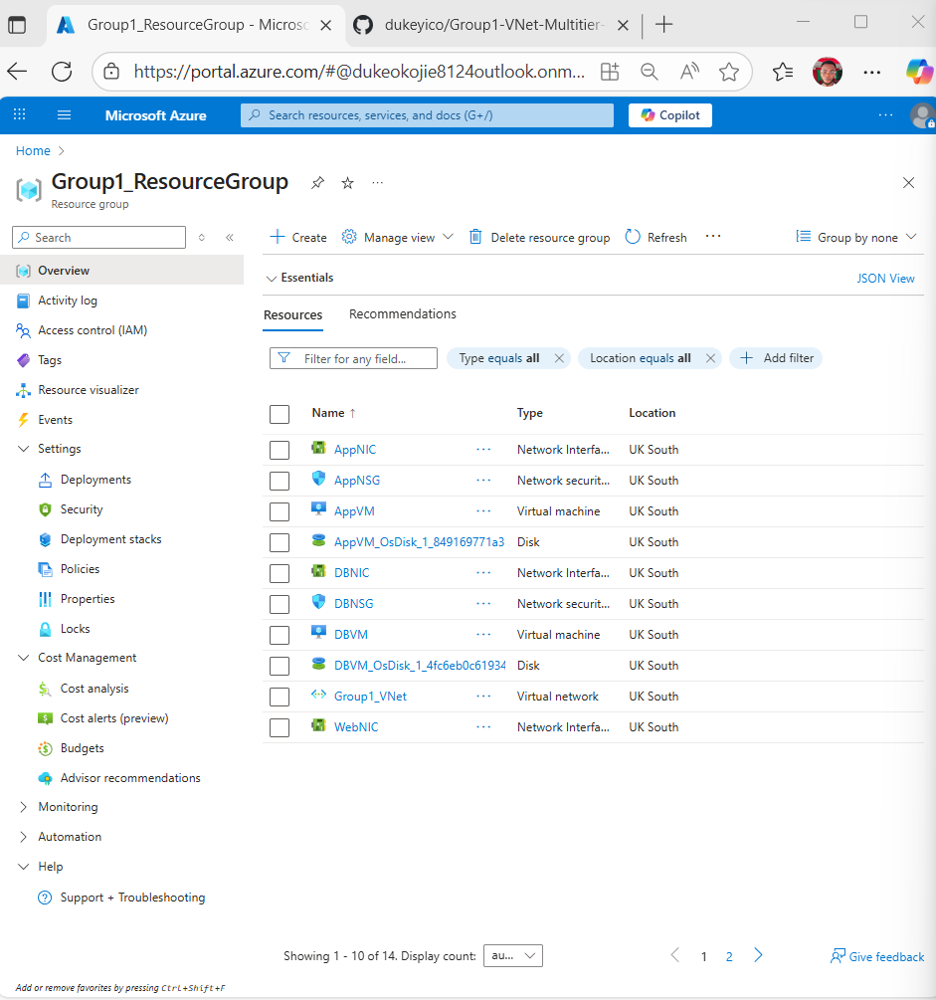
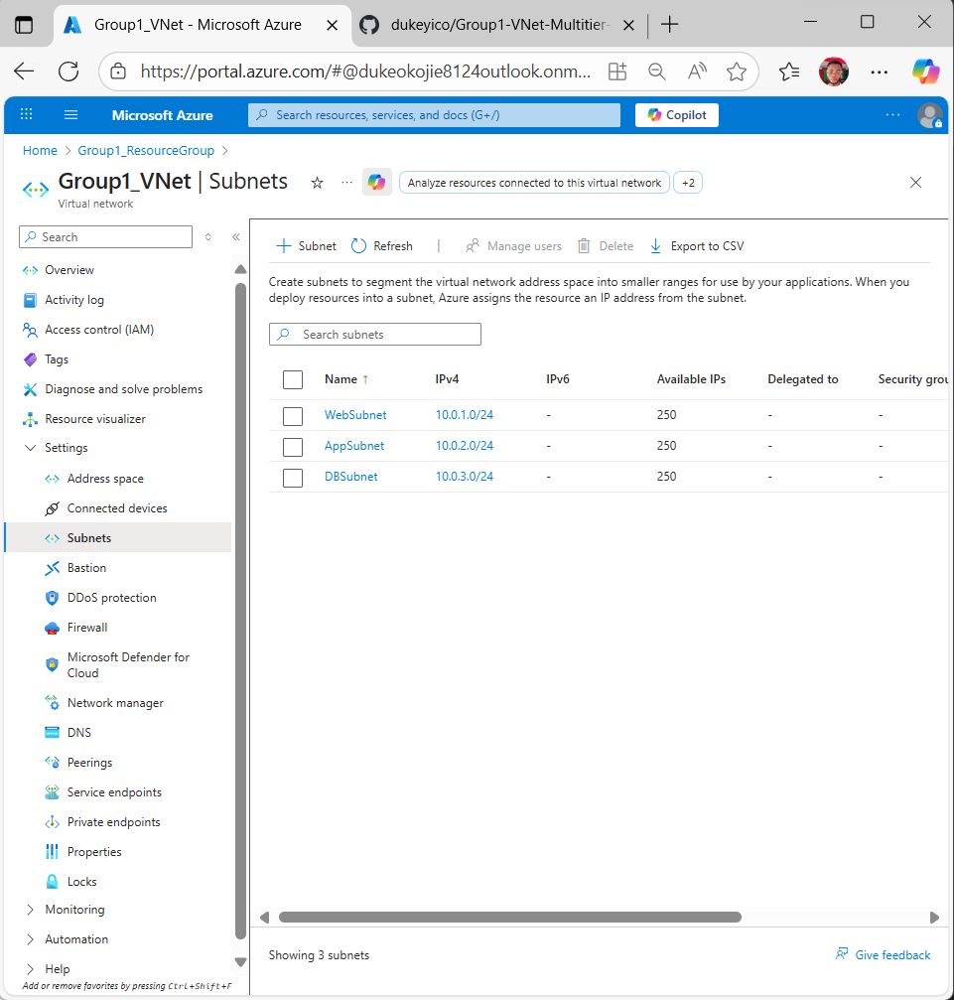
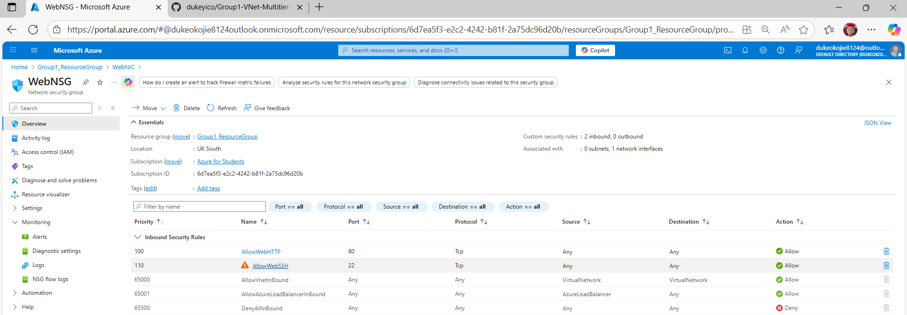
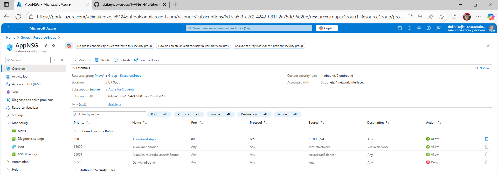
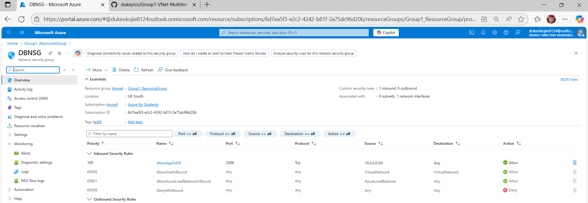
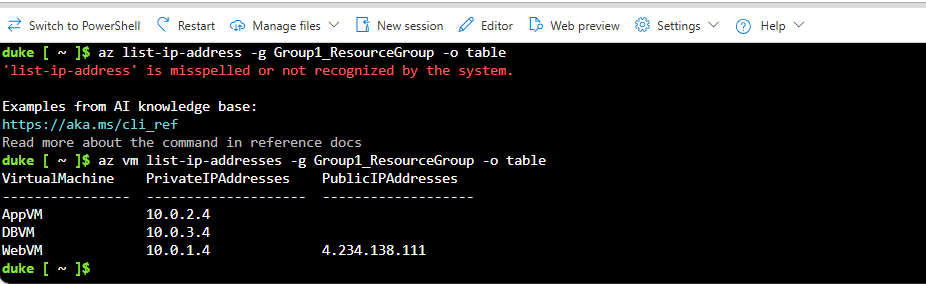
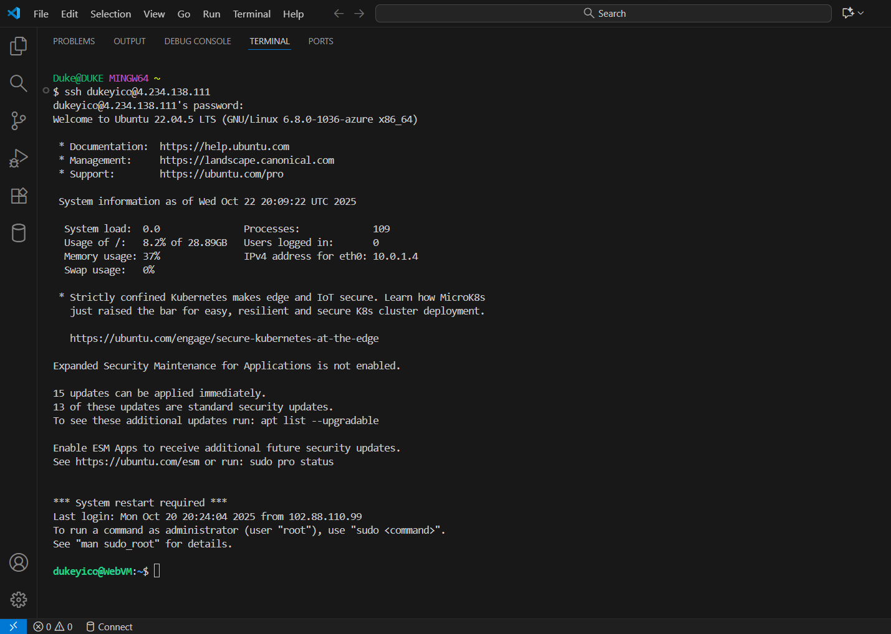
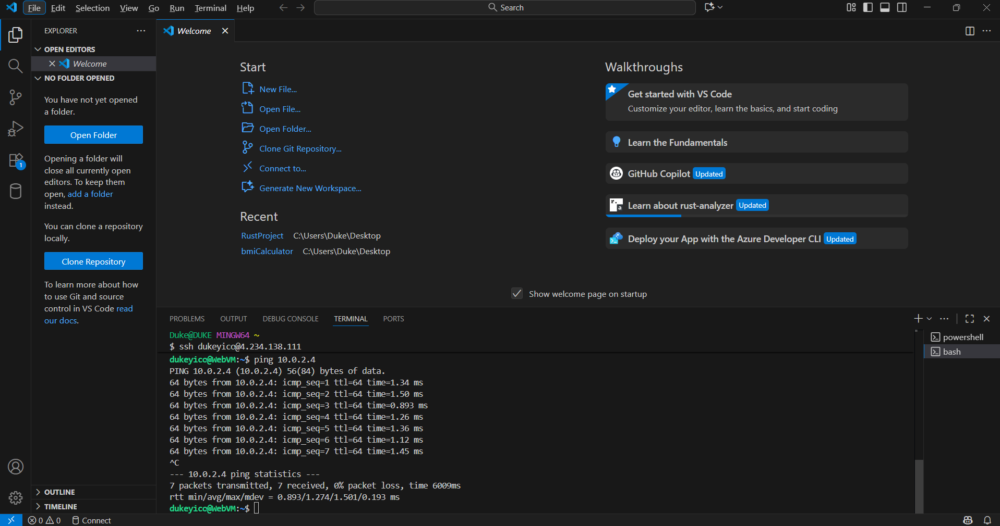
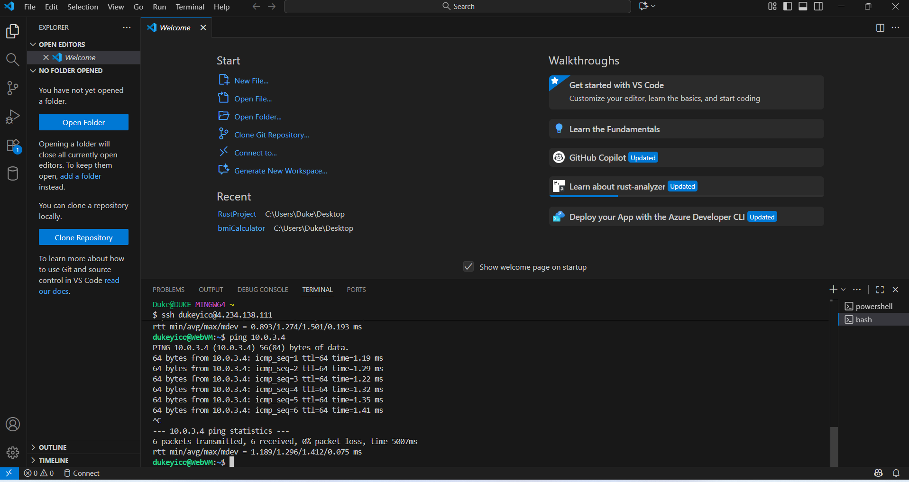

# Deployment Results – Group 1 Capstone Project

## Overview
This section presents the visual evidence of our successful Azure multi-tier deployment.  
Each screenshot validates a specific stage of the setup — from resource creation to internal network connectivity.

---

## Resource Group Created
**File:** `rg_list.png`  
**Description:** Resource group successfully created in **UK South (uksouth)**.

---

## Virtual Network and Subnets
**File:** `vnet_subnets.png`  
**Description:** VNet (`Group1VNet`) created with three subnets: `WebSubnet`, `AppSubnet`, and `DBSubnet`.

---

## Network Security Groups (NSGs)
### WebNSG
**File:** `webnsg_rules.png`  
**Description:** Inbound rules allow HTTP (port 80) and SSH (port 22) access from the internet.

### AppNSG
**File:** `appnsg_rules.png`  
**Description:** Inbound rule allows traffic from WebSubnet (10.0.1.0/24) on port 80.

### DBNSG
**File:** `dbnsg_rules.png`  
**Description:** Inbound rule allows traffic from AppSubnet (10.0.2.0/24) on port 3306.

---

## Virtual Machines – IP Addresses
**File:** `vm_ips.png`  
**Description:** Displays private and public IPs of WebVM, AppVM, and DBVM.

---

## SSH Access to WebVM
**File:** `ssh_web.png`  
**Description:** Shows successful SSH connection to WebVM using public IP.

---

## Internal Connectivity Tests
**Ping AppVM from WebVM**  
**File:** `ping_app.png`  
**Description:** Confirms network communication between Web and App tiers within the same VNet.

**Ping DBVM from WebVM**  
**File:** `ping_db.png`  
**Description:** Confirms communication between Web and Database tiers.

---

## Summary
All infrastructure components have been deployed and verified:
- Resource Group and VNet configuration
- Subnets and NSGs applied correctly
- VMs operational and reachable
- Internal communication (Web → App → DB) verified  

---

**Back to main documentation:**  
[Deployment Steps →](deployment-steps.md)
---

## Demo Video – Ping Test
[▶️ Watch Demo](https://drive.google.com/file/d/1XanNFDHMRP0XttqW-nCK6lUBGf1cFllF/view?usp=sharing)

> Demonstrates successful internal communication between Web, App, and DB tiers.

